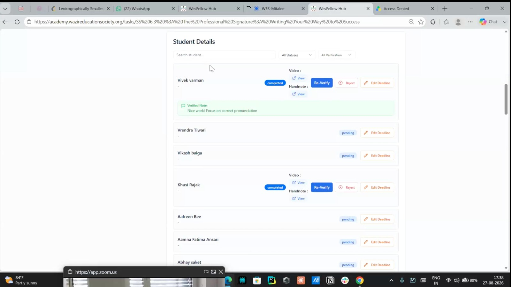
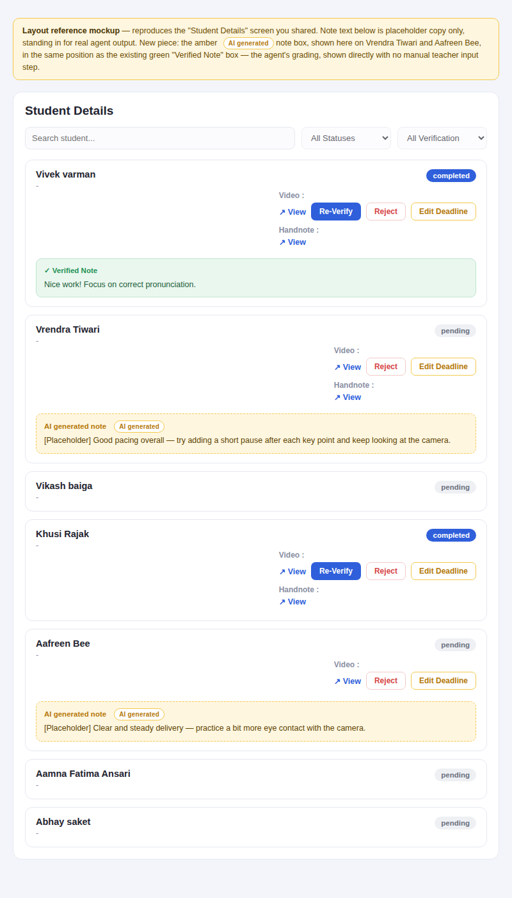
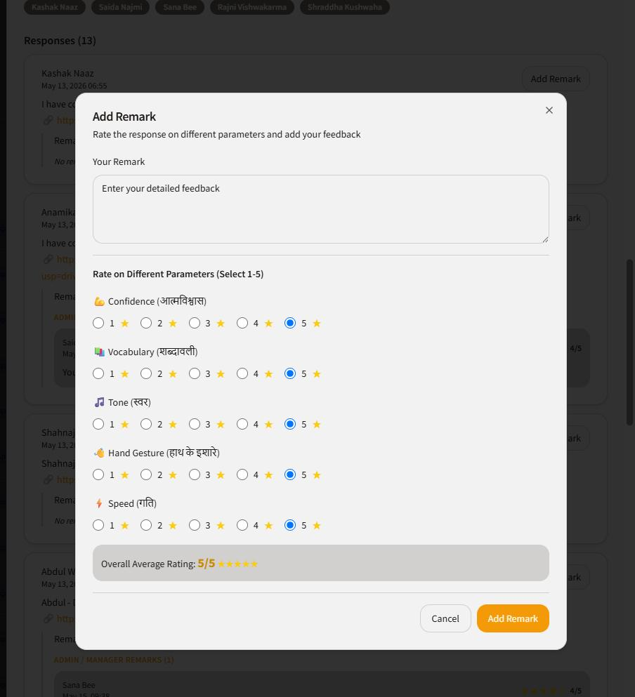
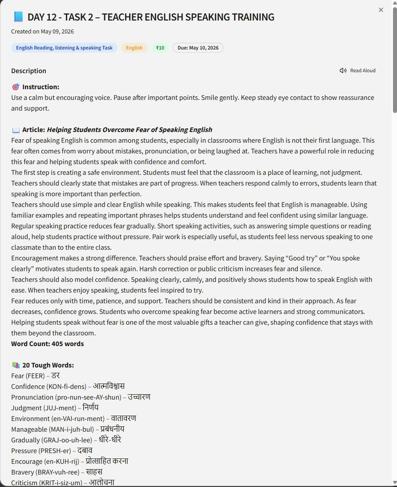
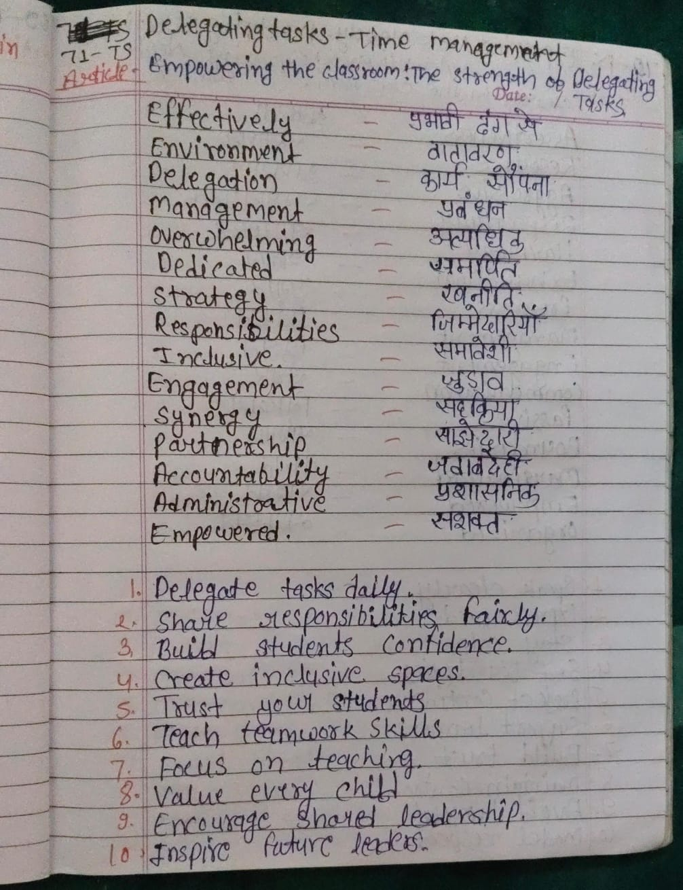

# Homework Grading Agent

*Draft wiki page — Wazir Education Society (WesFellow Hub / Mitalee). Status: draft, for review before merging.*

## Problem statement

For teachers, help them do grading of homework. Too many classes, too many students, and homework
for each period is difficult to manage — we need an agent to help them.

## Job to be done (JTBD)

Help teachers grade homework submitted by students as a video recording, where the student reads
from the assigned module. The agent evaluates each video on five parameters — **Confidence,
Vocabulary, Tone, Hand Gesture, Speed** — and shows an overall average rating out of 5. The same
grading needs to happen for the student's handwritten note as well; the parameters for that side
still need to be finalized (see [Handwritten note parameters](#handwritten-note-parameters)).

## Current UI — where the agent's output shows up

This is the existing "Student Details" screen (WesFellow Hub, `academy.wazireducationsociety.org`)
and it's the page the agent will continue to work inside of — grading happens behind the scenes,
and the result (status, verified note) surfaces here per student.



Each student row shows a status (`completed` / `pending`), links to the uploaded **Video** and
**Handnote**, and — once graded — a note summarizing the feedback (currently a manually-entered
"Verified Note"; see [Grading parameters](#grading-parameters) below for what the agent should be
generating automatically instead).

### Target state — same page, with the agent's note

The layout stays exactly as above. The only change is a new note block that carries the agent's
output, sitting in the same position the existing green "Verified Note" occupies:



The AI note is visually distinct from a teacher's verified note (amber, dashed, tagged
`AI generated`) so it's always clear which is which. It appears as soon as the agent has graded the
submission — **there is no approve/edit step and no manual input required from the teacher** to
make it appear. The existing `Re-Verify` and `Reject` controls stay where they are, so a teacher
can still act on a submission after the fact; they just aren't a gate the grade waits behind.

## Grading parameters

### Video submission parameters

This is the actual rating panel used today (manually, by a reviewer) — it's the exact parameter
set and scale the agent needs to reproduce automatically:



| Parameter | Hindi label | Scale |
|---|---|---|
| Confidence | आत्मविश्वास | 1–5 |
| Vocabulary | शब्दावली | 1–5 |
| Tone | स्वर | 1–5 |
| Hand Gesture | हाथ के इशारे | 1–5 |
| Speed | गति | 1–5 |

**Overall Average Rating** = simple average of the five parameter scores, shown out of 5 (e.g. all
five scored 5 → Overall Average Rating: 5/5).

### Handwritten note parameters

Not yet finalized — flagged explicitly in the JTBD above as something we still need to confirm.
Proposed starting point, to validate against a few real notes before locking in:

| Parameter | What it would check |
|---|---|
| Completion | Was the full assignment attempted (all vocabulary items / full list)? |
| Accuracy | Does the content match the reference material (spelling, meaning, translation)? |
| Legibility | Can it be read without guessing? |
| Format adherence | Did it follow the task's expected structure (e.g. word – meaning/translation, numbered action points)? |

## Module format

A module is the homework unit the agent grades against — authored once, reused across students.
Real example, Day 12 · Task 2:



```json
{
  "module_id": "day12_task2_english",
  "day": 12,
  "task_number": 2,
  "title": "Day 12 - Task 2 – Teacher English Speaking Training",
  "subject": "English",
  "tags": ["English Reading, listening & speaking Task"],
  "reward": "₹10",
  "due_date": "2026-05-10",
  "created_on": "2026-05-09",

  "instruction": "Use a calm but encouraging voice. Pause after important points. Smile gently. Keep steady eye contact to show reassurance and support.",

  "article_title": "Helping Students Overcome Fear of Speaking English",
  "reference_content": "Fear of speaking English is common among students, especially in classrooms where English is not their first language. This fear often comes from worry about mistakes, pronunciation, or being laughed at. Teachers have a powerful role in reducing this fear and helping students speak with confidence and comfort. ...",
  "word_count": 405,

  "word_list": [
    {"word": "Fear", "phonetic": "FEER", "meaning": "डर"},
    {"word": "Confidence", "phonetic": "KON-fi-dens", "meaning": "आत्मविश्वास"},
    {"word": "Pronunciation", "phonetic": "pro-nun-see-AY-shun", "meaning": "उच्चारण"},
    {"word": "Judgment", "phonetic": "JUJ-ment", "meaning": "निर्णय"},
    {"word": "Environment", "phonetic": "en-VAI-run-ment", "meaning": "वातावरण"},
    {"word": "Manageable", "phonetic": "MAN-i-juh-bul", "meaning": "प्रबंधनीय"},
    {"word": "Gradually", "phonetic": "GRAJ-oo-uh-lee", "meaning": "धीरे-धीरे"},
    {"word": "Pressure", "phonetic": "PRESH-er", "meaning": "दबाव"},
    {"word": "Encourage", "phonetic": "en-KUH-rij", "meaning": "प्रोत्साहित करना"},
    {"word": "Bravery", "phonetic": "BRAY-vuh-ree", "meaning": "साहस"},
    {"word": "Criticism", "phonetic": "KRIT-i-siz-um", "meaning": "आलोचना"}
  ],
  "word_list_count": 20
}
```

## Handwritten note — real example

Real student note for a different module ("Delegating Tasks – Time Management"), used here as the
reference example for what the agent reads on the handwriting side — a vocabulary list (English
term, Hindi translation) followed by numbered action points:



Transcribed content:

- **Article:** *Empowering the Classroom: The Strength of Delegating Tasks*
- **Vocabulary (11 terms):** Effectively – प्रभावी ढंग से, Environment – वातावरण, Delegation –
  कार्य सौंपना, Management – प्रबंधन, Overwhelming – अत्याधिक, Dedicated – समर्पित, Strategy –
  रणनीति, Responsibilities – जिम्मेदारियाँ, Inclusive – समावेशी, Engagement – जुड़ाव, Synergy –
  सहक्रिया, Partnership – साझेदारी, Accountability – जवाबदेही, Administrative – प्रशासनिक,
  Empowered – सशक्त
- **10 action points:** Delegate tasks daily · Share responsibilities fairly · Build students'
  confidence · Create inclusive spaces · Trust your students · Teach teamwork skills · Focus on
  teaching · Value every child · Encourage shared leadership · Inspire future leaders

## Open items

- Finalize the handwritten-note parameter set (currently proposed, not confirmed).
- Confirm whether Overall Average Rating should stay a simple mean of the five video parameters,
  or take weights per module type.
- Confirm how the Academic (handwriting) score is meant to combine with, or stay separate from,
  the video's Overall Average Rating on the Student Details screen.
